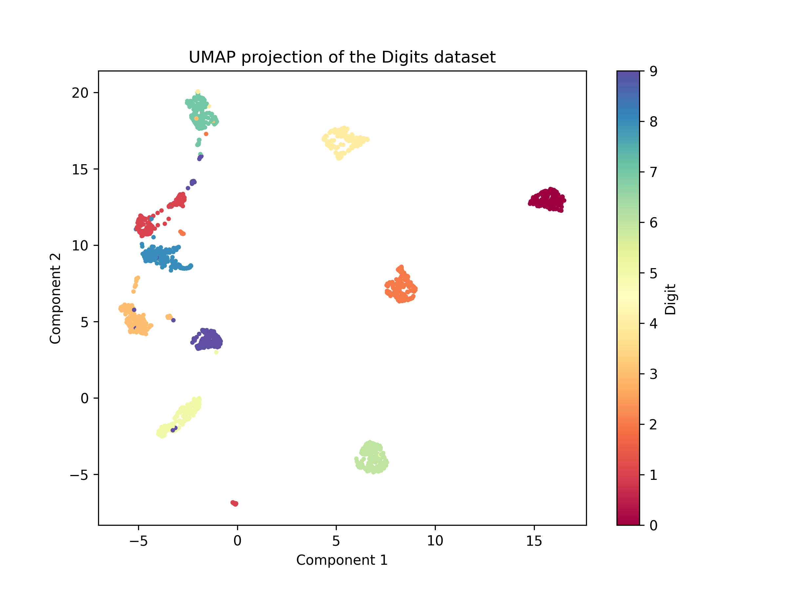

# Iris KNN Model

This project implements a simple K-Nearest Neighbors (KNN) model using the Iris dataset. The model is trained to classify Iris species based on their features and can be used to make predictions on new data.

## Project Structure

The project is composed of the following files:

- `main.py`: The main script to train the model, load data, and make predictions.
- `train.py`: Contains the `Model` class, which defines the KNN model, training procedure, and evaluation metrics.
- `iris_data.json`: Input data file containing Iris records to make predictions on.
- `model.pkl`: The saved KNN model after training.
- `out.json`: Output file containing the predictions for the given input data.

## Setup

### Prerequisites

This project requires Python 3.6+ and the following Python packages:

- `scikit-learn`
- `pickle`
- `json`

<!--  -->

